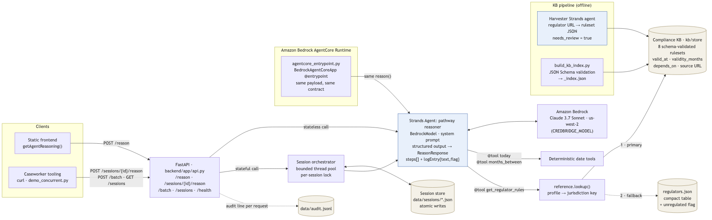

# Credential Bridge

**A Strands agent that plans an internationally trained professional's licensing pathway, grounded in a per-jurisdiction compliance knowledge base — for settlement caseworkers and the people they serve.**

Agents for Humans Hackathon 2026 · Good Neighbor track · Apache-2.0 · Strands Agents SDK + Amazon Bedrock

---

## The problem
A nurse trained in Manila or a civil engineer trained in Lagos can't practise in Canada, the US, the UK, Australia or Germany without clearing a licensing sequence — credential evaluation, language testing, registration, board exams, sometimes supervised experience. The **order, the prerequisites, and the validity windows differ by profession and by province, state or country**. A single timing mistake — a language result that expires before the registration decision it has to support — can send an applicant back a step that already cost months and fees.

## Who it's for
Settlement-agency and nonprofit caseworkers who guide internationally trained professionals through credential recognition today, largely by hand and one client at a time — and the professionals themselves.

## Why it matters
The professions involved (nursing, medicine, engineering, teaching) are ones with persistent shortages, and every month a qualified person spends stuck on sequencing is a month they aren't working in their field. A static checklist lists requirements; it doesn't notice when two of them stop lining up. Credential Bridge is built to build a personal pathway, detect those conflicts, and explain the re-plan in plain language, with a source link on each step so a caseworker can check it.

## What it does
Given an applicant profile and an event, the agent is designed to:
1. **Build a personal, ordered pathway** for the profession + target jurisdiction, from grounded data (regulator, gateway body, exam, language tests and their validity windows), with `source` / `sourceUrl` on each step.
2. **Reason about prerequisite and expiry dependencies** — e.g. a language test that must be valid at the *registration decision*, not merely at application (`valid_at` in the KB).
3. **Re-plan on an event** — `simulate_delay` marks the affected steps `at-risk` and explains the collision using dates computed by deterministic tools; `simulate_rejection` inserts a remediation step and blocks dependents; `reset` rebuilds the clean plan.
4. **Recognize unregulated professions** — for Software Engineer the grounding lookup returns `unregulated: true`, and the agent returns a short work-authorization pathway and says no practice licence is required, instead of forcing a licensing template.

Decisions (ordering, which pair collides, the explanation) come from the model via **Strands structured output** validated against the pydantic contract — not from templated strings. Date arithmetic lives in tools.

## Demo
Video: _link pending (plan: [docs/VIDEO_SCRIPT.md](docs/VIDEO_SCRIPT.md))_. Every beat in the video maps to a command in [Run it](#run-it).

## Accuracy
_Pending live evaluation run (see docs/evidence/)_

## Architecture


Details and the mermaid source: [docs/ARCHITECTURE.md](docs/ARCHITECTURE.md).

```
Static frontend ──POST /reason──────────────────────┐
curl / demo_concurrent.py ──POST /sessions/{id}/reason · /batch · GET /sessions
                                                     ▼
            FastAPI  /reason · /sessions/{id}/reason · /batch · /sessions · /health   (audit → data/audit.jsonl)
               │ stateless                          │ stateful
               │                     Session orchestrator ── session store (data/sessions/<id>.json)
               │                     bounded thread pool · per-session lock
               ▼                                    │
      Strands Agent (Claude 3.7 Sonnet on Amazon Bedrock, us-west-2) ◀──┘
        tools: get_regulator_rules · today · months_between
        output: structured ReasonResponse { steps[], logEntry{text,flag}, regulator?, regulatorUrl? }
               │ get_regulator_rules → reference.lookup(profile → jurisdiction key)
               ├─ 1. PRIMARY   kb/store/<JURIS>/<profession>.json   compliance KB, 8 JSON-Schema-validated rulesets
               └─ 2. FALLBACK  backend/reference/regulators.json   compact table for pairs not in the KB + unregulated flag

KB pipeline (offline):  harvester Strands agent → kb/store (needs_review=true) · build_kb_index.py validates → _index.json
AgentCore Runtime:      backend/agentcore_entrypoint.py wraps the same reason() → same request/response contract
```

## Run it
Requires Python 3.11+, AWS credentials, and Bedrock model access for `us.anthropic.claude-3-7-sonnet-20250219-v1:0` in `us-west-2`.

```bash
cd backend
cp .env.example .env
set -a; source .env; set +a          # the app reads the shell environment; .env is not auto-loaded
export CREDBRIDGE_TODAY=2026-09-14   # optional: pin "today" so expiry dates are reproducible
./run_local.sh                       # creates .venv, installs requirements, uvicorn on :8000
```

No-AWS checks (contract, grounding reachability, KB schema):
```bash
cd backend && source .venv/bin/activate
python tests_smoke.py                     # every KB ruleset resolves from a natural profile; contract round-trips
pip install jsonschema                    # optional: full JSON Schema validation (else a required-key check)
python ../kb/pipeline/build_kb_index.py   # validates kb/store/**, prints counts (8 rulesets, 7 jurisdictions), rewrites _index.json
```

### Try the endpoint
```bash
curl -s localhost:8000/health            # {"status":"ok"}

# 1) build a pathway (stateful session: the server stores the steps)
curl -s -X POST localhost:8000/sessions/aida-demo/reason -H 'content-type: application/json' -d '{
 "profile":{"name":"Aida Torres","profession":"Registered Nurse","countryTrained":"Philippines","targetCountry":"Canada","targetRegion":"Ontario"},
 "event":"build_pathway","currentSteps":[]}' | python -m json.tool

# 2) inject a delay — with currentSteps [] the session endpoint feeds back the steps stored by call 1
curl -s -X POST localhost:8000/sessions/aida-demo/reason -H 'content-type: application/json' -d '{
 "profile":{"name":"Aida Torres","profession":"Registered Nurse","countryTrained":"Philippines","targetCountry":"Canada","targetRegion":"Ontario"},
 "event":"simulate_delay","currentSteps":[]}' | python -m json.tool

# 3) the judgment case — unregulated profession (stateless endpoint)
curl -s -X POST localhost:8000/reason -H 'content-type: application/json' -d '{
 "profile":{"name":"Wei Chen","profession":"Software Engineer","countryTrained":"China","targetCountry":"Canada","targetRegion":"Ontario"},
 "event":"build_pathway","currentSteps":[]}' | python -m json.tool
```
`simulate_rejection` and `reset` use the same body with a different `event`. To check grounding by hand, take a `sourceUrl` from a response and look for it in the jurisdiction's file, e.g. `grep -c "cno.org" kb/store/CA-ON/registered-nurse.json` (run from repo root).

If structured output fails on your Strands version, `reason()` falls back to a plain call and validates the largest JSON block against the same pydantic model; if nothing validates, the request errors rather than returning a malformed object.

### API contract
`POST /reason`
```jsonc
// request
{ "profile": { "name": "Aida Torres", "profession": "Registered Nurse",
               "countryTrained": "Philippines", "targetCountry": "Canada", "targetRegion": "Ontario" },
  "event": "build_pathway",              // build_pathway | simulate_delay | simulate_rejection | reset
  "currentSteps": [] }
// response (shape; values illustrative)
{ "steps": [ { "id": 1, "title": "...", "status": "upcoming", "detail": "...",
               "source": "College of Nurses of Ontario (CNO)", "sourceUrl": "https://..." } ],
  "logEntry": { "text": "...", "flag": false },
  "regulator": "College of Nurses of Ontario (CNO)", "regulatorUrl": "https://..." }
```
`status` ∈ complete · in-progress · upcoming · not-started · at-risk; `id`s are 1..n. Schemas: `backend/app/schemas.py`.

| endpoint | purpose |
|---|---|
| `POST /reason` | stateless single call (the frontend contract) |
| `POST /sessions/{id}/reason` | stateful: seeds `currentSteps` from the stored session when the request sends `[]` |
| `POST /batch` | run many sessions' events concurrently |
| `GET /sessions` | list stored sessions |
| `GET /health` | liveness |

### Many caseworker sessions at once
```bash
cd backend && python demo_concurrent.py     # server running; fires 5 sessions in parallel
curl -s localhost:8000/sessions | python -m json.tool
```
Each session's state is written atomically under a per-session lock; `POST /batch` runs many sessions concurrently on a bounded pool (`CREDBRIDGE_MAX_CONCURRENCY`, default 4). See [docs/ORCHESTRATION.md](docs/ORCHESTRATION.md).

### Coverage
Reproduce with `ls kb/store/*/` and `python -m json.tool backend/reference/regulators.json`.

| profession | compliance KB (`kb/store`, primary) | fallback (`regulators.json`) |
|---|---|---|
| Registered Nurse | CA-ON, CA-BC, US-NY, US-CA, GB, AU, DE | CA-AB, US-TX |
| Civil Engineer | CA-ON | CA-BC, CA-AB, US-CA, US-TX, US-NY |
| Physician | — | CA-ON, US-NY |
| Teacher | — | CA-ON, CA-BC, US-NY |
| Software Engineer | — | unregulated in all covered jurisdictions |

`targetCountry` accepts names like "Canada", "United States"/"USA", "United Kingdom"/"UK", "Australia", "Germany"; `targetRegion` names the province/state for Canada and the US (GB, AU, DE are national). An unknown country or region returns `unknown_region` — it is never mapped to a guess. Domain model: [kb/ontology/credential-ontology.md](kb/ontology/credential-ontology.md).

## AgentCore
**Status: entrypoint written, not yet deployed** (pending AWS credentials). `backend/agentcore_entrypoint.py` is a `BedrockAgentCoreApp` whose `@app.entrypoint` accepts the `/reason` body and returns the same response via the same `reason()` function.

The commands below use the `agentcore` CLI from the pip package `bedrock-agentcore-starter-toolkit`. The current Strands docs point to the newer AgentCore CLI (`npm install -g @aws/agentcore`: `create` / `dev` / `deploy` / `invoke`), which replaces that toolkit — install one or the other, not both.
```bash
cd backend
pip install bedrock-agentcore bedrock-agentcore-starter-toolkit
agentcore configure --entrypoint agentcore_entrypoint.py --name credential-bridge
agentcore launch
agentcore invoke '{"profile":{"name":"Aida Torres","profession":"Registered Nurse","countryTrained":"Philippines","targetCountry":"Canada","targetRegion":"Ontario"},"event":"build_pathway","currentSteps":[]}'
```
AgentCore Runtime runs linux/arm64 containers; enable the model in the same region, and give the execution role `bedrock:InvokeModel`. Once deployed, the frontend's `fetch()` URL is the only thing that changes.

## Data sources & honesty note
- All 8 KB rulesets are `harvest_method: "curated"` from official regulator pages; each carries `source` URLs, a `confidence`, and `needs_review`. `regulators.json` is a compact curated table covering pairs not yet in the KB. Source-URL liveness has not been re-checked yet.
- The harvester agent writes rulesets with `needs_review: true`; they're unverified until a human clears them. No harvested ruleset is in the KB yet.
- Every pathway step is meant to carry its source so a human can verify it. This is a **research aid for caseworkers, not legal or immigration advice**; licensing rules change.
- **Built during the hackathon / pre-existing code:** built during the submission period (Aug 10 – Sep 14, 2026). The initial backend / KB / docs scaffold was committed unmodified on 2026-09-13 (`11b25f3`) from the team's own working copy, as a baseline; every change after it is a separate commit. The static frontend (by Nash) was added on 2026-09-13 (`0b443ed`). _[TODO(team): confirm the scaffold and frontend were created within the submission period.]_ Third-party: Strands Agents SDK (`strands-agents`, `strands-agents-tools`), `bedrock-agentcore`, FastAPI, Uvicorn, Pydantic, boto3, python-dotenv (see `backend/requirements.txt`); the frontend loads Google Fonts (Fraunces, IBM Plex Sans, IBM Plex Mono).

## Roadmap
- Expose the case graph already in the repo (`backend/app/orchestration/case_graph.py`: Strands `GraphBuilder`, pathway → human-approval edge → finalize) and the deadline watcher (`backend/app/agents/watcher.py`) through the API.
- Harvest the 7 queued pairs in `kb/sources/harvest_queue.jsonl`, with human review before `needs_review` flips.
- Automated source-URL checks; a grounding evaluation set stored in `docs/evidence/`.
- Swap the file-backed session store for DynamoDB or AgentCore Memory; scope CORS down from `*`.

## License
Apache-2.0 — see [LICENSE](LICENSE).

## Team
Kanwar Jhattu · Youssef Nashaat

## Frontend
Static UI by Nash — `index.html`, `styles.css`, `app.js`, `agent.js`, `pathways.js` at the repo root. No build step; the only external request is Google Fonts. Serve it from the repo root and open it in a browser:
```bash
python3 -m http.server 8765      # then open http://localhost:8765/
```
Any static host works (publish directory = repo root).

> **Status:** as merged, the UI runs a *simulated* agent in the browser (demo mode) — its dates and regulator names are illustrative, not from the KB. Wiring it to `POST /reason` so every step comes from the grounded agent is task T12 in [docs/TASKS.md](docs/TASKS.md).
