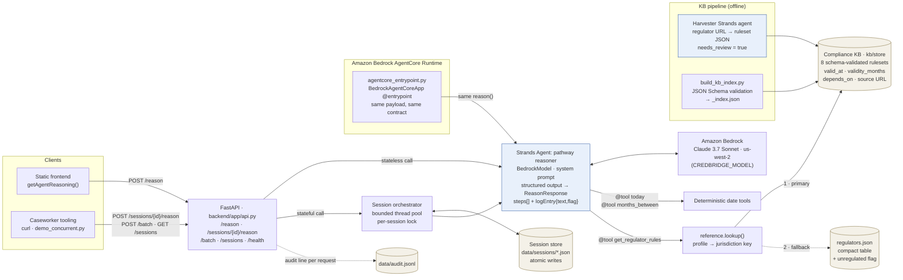

# Architecture

Rendered from the mermaid below:
`npx -y @mermaid-js/mermaid-cli -i <this-diagram>.mmd -o docs/architecture.png -b white -w 1600`
(copy the block into a `.mmd` file first).

## Components
| component | file | role |
|---|---|---|
| HTTP API | `backend/app/api.py` | `/reason` (stateless), `/sessions/{id}/reason` (stateful), `/batch`, `/sessions`, `/health`; CORS; appends one audit line per request to `data/audit.jsonl` |
| Pathway reasoner | `backend/app/agent.py` | Strands `Agent` + `BedrockModel`; tools `get_regulator_rules`, `today`, `months_between`; structured output into `ReasonResponse`, with a validated text-parse fallback; ids renumbered 1..n |
| Grounding lookup | `backend/app/reference.py` | maps the free-text profile to a jurisdiction key (`CA-ON`, `US-NY`, `GB`, `AU`, `DE`, …); reads **`kb/store` first**, falls back to `backend/reference/regulators.json`; unknown → `unknown_region`, unregulated → `unregulated: true` |
| Compliance KB | `kb/store/**`, `kb/schema/ruleset.schema.json`, `kb/ontology/credential-ontology.md` | one ruleset per profession × jurisdiction; requirements typed by `kind` with `valid_at`, `validity_months`, `depends_on`, `source` |
| KB pipeline | `kb/pipeline/*.py` | `build_kb_index.py` validates every ruleset against the schema and writes `_index.json` (no AWS); `run_harvest.py` / `run_harvest_batch.py` call the harvester |
| Harvester | `backend/app/agents/harvester.py` | second Strands agent with a web-fetch tool; regulator URL → ruleset JSON with `harvest_method: agent`, `needs_review: true` |
| Session orchestrator | `backend/app/orchestration/orchestrator.py`, `session_store.py` | bounded `ThreadPoolExecutor` across sessions; per-session lock + atomic JSON write; seeds `currentSteps` from the stored session when a request sends `[]` |
| AgentCore entrypoint | `backend/agentcore_entrypoint.py` | `BedrockAgentCoreApp` `@app.entrypoint` accepting the `/reason` body; same `reason()`; deployment pending |

**In the repo, not on the request path yet:** `backend/app/orchestration/case_graph.py` (a Strands
`GraphBuilder` graph: pathway node → finalize node behind a conditional edge on
`invocation_state["approved"]`, i.e. a human-approval gate) and `backend/app/agents/watcher.py` (a
deterministic scan that flags dated requirements within a 45-day window, no model call). Neither is
exposed through an endpoint, so neither appears in the diagram or the demo.

## Why this shape
- **Grounded, not generated from memory.** The agent calls `get_regulator_rules` first; the KB is the primary source and the compact table only fills gaps. The model reasons over returned data, so each step can be traced to a source URL.
- **Judgment is in the model; arithmetic is in tools.** `today` (pinnable via `CREDBRIDGE_TODAY`) and `months_between` do the date math. Sequencing, which dependency collides, the unregulated-profession call, and the explanation come from the agent.
- **The KB encodes *when* a document must be valid.** `valid_at` ∈ {application, registration_decision, exam, continuous} is what lets the agent detect an expiry collision instead of just listing documents.
- **One contract, two runtimes.** FastAPI and the AgentCore entrypoint call the same `reason()` with the same pydantic models, so the frontend only changes its URL.
- **State outside the agent.** Session state lives in the session store, keyed by session id, so cases are isolated from each other.

## Event behaviour (as instructed by the system prompt)
| event | agent is instructed to | flag |
|---|---|---|
| build_pathway | grounded, ordered pathway + opening summary + honest timeframe | false |
| simulate_delay | pick a real dependent pair in `currentSteps`, mark affected steps at-risk, explain with actual dates and a concrete recommendation | true |
| simulate_rejection | mark an early step at-risk, insert a remediation step after it, renumber, set blocked dependents to not-started, explain | true |
| reset | regenerate the clean pathway | false |
| (unregulated profession) | 2–3 work-authorization steps; state that no practice licence is required | false |
