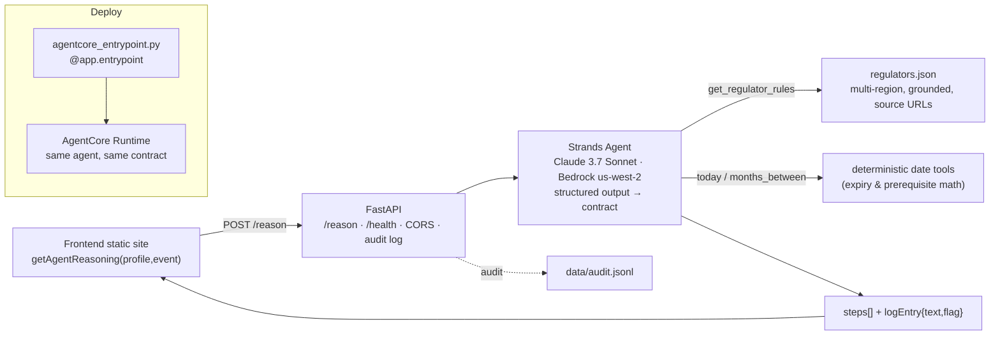

# Architecture

**Why this shape.**
- **Grounded, not generative-from-memory.** Every step is based on `get_regulator_rules`; the model reasons over regulator data instead of recalling it, so a judge can trace each step to a source URL.
- **Judgment is visible.** Date math lives in deterministic tools; the *decisions* (sequencing, conflict detection, the unregulated-profession call, the re-plan explanation) come from the agent — which is what makes this an agent and not a form wizard.
- **One contract, two runtimes.** The identical agent serves both FastAPI (local/dev, easy demo) and AgentCore Runtime (managed), so the frontend never changes.

## Event behaviour
| event | agent does |
|---|---|
| build_pathway | grounded, ordered pathway + opening summary + timeframe (flag=false) |
| simulate_delay | finds a real expiry/prereq collision in currentSteps, marks steps at-risk, explains with actual dates (flag=true) |
| simulate_rejection | marks early step at-risk, inserts remediation step, blocks dependents, explains (flag=true) |
| reset | regenerates the clean pathway (flag=false) |
