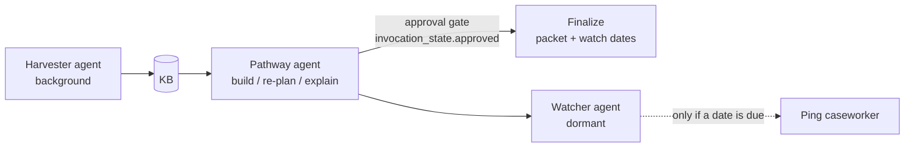

# Orchestration — simultaneous sessions + multi-agent composition

Two independent axes:

## Axis 1 — many sessions at once (caseworker concurrency)
A settlement agency has many caseworkers, each juggling many applicant cases. Each case is a
**session** with isolated, persisted state.

```mermaid
flowchart TB
  subgraph Clients
    C1[Caseworker A · case Aida]:::c
    C2[Caseworker A · case Mateus]:::c
    C3[Caseworker B · case Lena]:::c
    C4[Caseworker B · case Wei]:::c
  end
  C1 & C2 & C3 & C4 -->|POST /sessions/{id}/reason| API[FastAPI]
  API --> ORCH[Orchestrator<br/>shared Strands agent · bounded thread pool]
  ORCH -->|per-session lock| S1[(session Aida)]
  ORCH --> S2[(session Mateus)]
  ORCH --> S3[(session Lena)]
  ORCH --> S4[(session Wei)]
  ORCH --> BR[Amazon Bedrock<br/>Claude 3.7 Sonnet]
  BR --> KB[(Compliance KB<br/>7 jurisdictions)]
  classDef c fill:#eef;
```

**Guarantees**
- Different sessions run **truly in parallel** (thread pool, bounded by `CREDBRIDGE_MAX_CONCURRENCY`
  to respect Bedrock limits).
- The **same** session is serialized against itself by a per-session lock + atomic write, so its
  step-list never corrupts under concurrent events.
- State lives in the session store (`data/sessions/<id>.json`), not in the agent — the agent is
  stateless per call, so one shared instance serves everyone (no cold-start per request).
- On **AgentCore Runtime**, each session already gets its own microVM (isolation for free); this
  layer gives identical semantics locally and defines the contract.

**Demo:** `python backend/demo_concurrent.py` fires 5 caseworker sessions at once (nurse→Ontario,
nurse→New York, nurse→Germany, software engineer→Ontario, civil engineer→Ontario) and shows them
all resolve in one wall-clock window, each persisted independently (`GET /sessions`).

## Axis 2 — many agents per case (multi-agent composition)
Within one case, the specialized agents compose as a **Strands Graph**:



- **pathway** serves `/reason`. **harvester** populates the KB (its own cadence). **watcher** is
  dormant — no model call unless a dated requirement is inside its window. The **approval edge**
  means the case can't finalize without a human.
- `backend/app/orchestration/case_graph.py` builds this graph; `MultiAgentPlugin`/hooks give
  orchestrator-level tracing (Strands supports session persistence + streaming on Graph/Swarm).

## Endpoints
| endpoint | purpose |
|---|---|
| POST /reason | stateless single call (original frontend contract) |
| POST /sessions/{id}/reason | stateful per-session (seeds currentSteps from stored state) |
| POST /batch | run many sessions' events concurrently |
| GET /sessions | list active sessions |
| GET /health | liveness |
