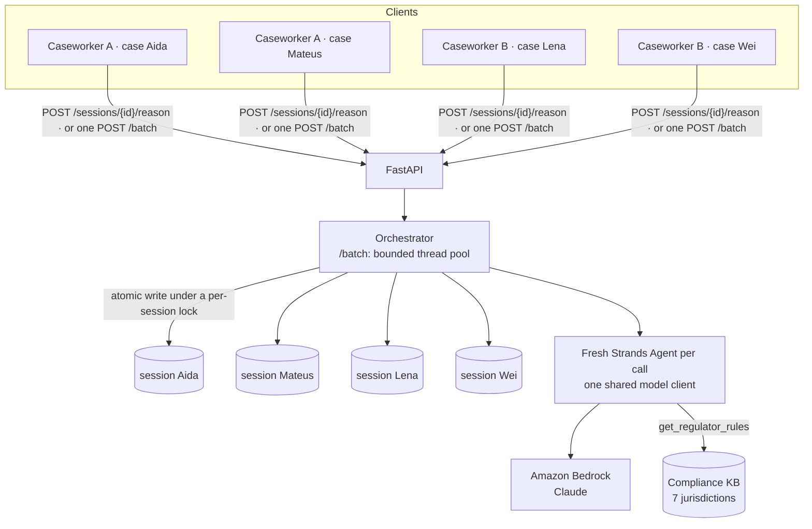
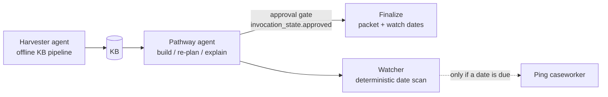

# Orchestration — simultaneous sessions + multi-agent composition

Two independent axes:

## Axis 1 — many sessions at once (caseworker concurrency)
A settlement agency has many caseworkers, each juggling many applicant cases. Each case is a
**session** with its own persisted state.

**What holds today**
- **Parallel across sessions.** `POST /batch` runs many sessions' events at once on a bounded thread
  pool (`CREDBRIDGE_MAX_CONCURRENCY`, default 4) to stay inside Bedrock limits.
  `POST /sessions/{id}/reason` runs each request on FastAPI's own worker threads.
- **Atomic per-session writes.** Each session's state is written under a per-session lock with an
  atomic file replace (`session_store.update`), so a session file is never half-written and
  sessions never overwrite each other.
- **Known gap: simultaneous events on the *same* session.** The orchestrator reads the stored steps
  and calls the agent *before* it takes the lock (`orchestrator.py`, `handle`). If two events hit
  the same session at the same moment, both can start from the same steps, and the later write
  wins. Different sessions are unaffected. A fix is planned: hold the session for the whole event.
- **No shared conversation state.** The process shares one model client, but `reason()` builds a
  fresh Strands `Agent` for every call (`backend/app/agent.py`, `_fresh`). A Strands `Agent` keeps
  its message history and rejects overlapping calls. A single shared agent would therefore carry one
  applicant's context into the next and fail under concurrent requests.
- State lives in the session store (`data/sessions/<id>.json`), not in the agent.
- On **AgentCore Runtime**, each runtime session gets its own microVM. This layer gives the same
  per-case semantics locally. (The Runtime is deployed as `credential_bridge`; see the README's
  AgentCore section.)

**Demo:** `python backend/demo_concurrent.py` fires 5 caseworker sessions at once from client
threads against `POST /sessions/{id}/reason`: nurse→Ontario, nurse→New York, nurse→Germany,
software engineer→Ontario and civil engineer→Ontario. All five resolve in one wall-clock window,
each persisted independently (`GET /sessions`).

## Axis 2 — many agents per case (multi-agent composition)
Within one case, the specialized pieces are designed to compose as a **Strands Graph**. Only the
pathway agent is on the request path today.

- **pathway** serves `/reason`. The **harvester** populates the KB offline
  (`kb/pipeline/run_harvest*.py`), and every ruleset it writes starts as `needs_review: true`. The
  **watcher** (`backend/app/agents/watcher.py`) scans step dates and flags anything inside a 45-day
  window, without calling a model.
- `backend/app/orchestration/case_graph.py` builds the pathway → finalize graph with Strands
  `GraphBuilder`. The edge carries a condition on `invocation_state["approved"]`, so a case can't
  finalize without a human. It isn't exposed through an endpoint yet, and neither is the watcher.

## Endpoints
| endpoint | purpose |
|---|---|
| POST /reason | stateless single call (what the frontend uses) |
| POST /sessions/{id}/reason | stateful per-session (seeds currentSteps from stored state) |
| POST /batch | run many sessions' events concurrently on the bounded pool |
| GET /sessions | list stored sessions |
| GET /health | liveness |
